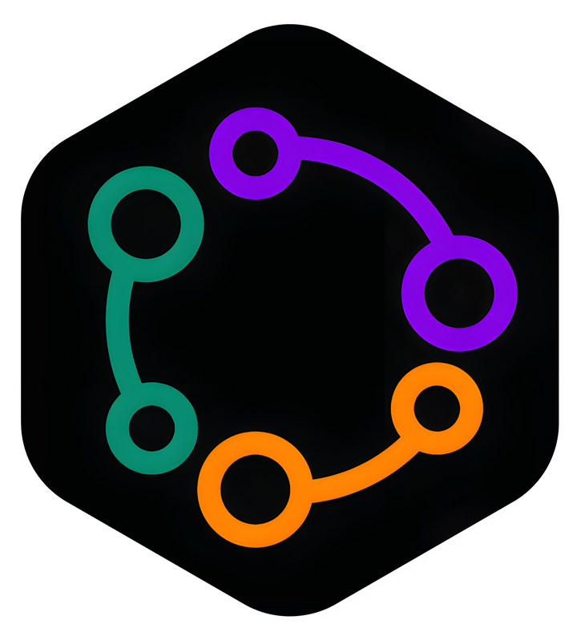

# Leonard Egbaaibon - Portfolio 🚀

Welcome to my portfolio! This repository showcases my work as a **Frontend Engineer**, **Native Mobile Developer**, and **Product Designer**. It includes detailed insights into my projects, work experience, and skills.

## 🌐 Live Preview
Visit my live portfolio [here](#).

---

## 📜 About Me

Hi, I’m **Leonard Egbaaibon** 👨‍💻  
I specialize in delivering intuitive, high-performance applications for web, mobile, and desktop platforms. My expertise includes:  
- **Frontend Development:** React, Tailwind CSS, and modern JavaScript frameworks.  
- **Native Mobile Development:** Kotlin, Android Studio, React Native.  
- **UI/UX Design:** Figma, Spline, and creating pixel-perfect designs.  

Currently, I’m learning advanced Kotlin to deepen my mobile development skills and enhance my design expertise.

---

## 🖼️ Portfolio Features

### Navigation
A clean and responsive navigation bar featuring:  
- Links to **Home**, **About**, **Projects**, and **Contact** sections.  
- A **Download** button for accessing my résumé.  

### Dynamic Animations  
Built with **Framer Motion** for smooth animations and transitions.

### Spline Integration  
Interactive 3D models using **Spline Viewer** for a captivating visual experience.

### Highlights
- Dynamic rendering of professional journey using **Vertical Timeline**.
- Interactive design and development showcases with high-quality imagery.  

---

## 📚 Work Experience

### Mobile Developer @ Spacepay Labs
📍 **Location:** Lagos, Nigeria  
📅 **Duration:** 2011 - Present  
**Tech Stack:**  
- React Native, Expo, Axios for API calls  
- React Navigation for seamless transitions  
- Jest for unit testing  
- Redux for state management  

---

### Software Engineer & Product Designer @ Tsaron Telematics  
📍 **Location:** Lagos, Nigeria  
📅 **Duration:** 2010 - 2011  
**Tech Stack:**  
- Kotlin (Android), XML  
- Vue.js (Web), Tailwind CSS  
- React Navigation  

---

## 📂 Featured Projects

### Spacepay Lab
  
**Overview:** Designed and developed mobile solutions for efficient payment systems.  

---

### Gumshoe
  
**Overview:** Created innovative solutions for telematics and IoT applications.  

---

### Mogroup
  
**Overview:** Built scalable applications for logistics and management systems.  

---

## 🛠️ Technologies

- **Frontend:** React, Tailwind CSS, JavaScript/TypeScript  
- **Mobile Development:** React Native, Kotlin, Android Studio  
- **Design Tools:** Figma, Spline  
- **Version Control:** Git & GitHub  

---

## 🔗 How to Use This Portfolio Locally

1. **Clone this repository:**  
   ```bash
   git clone https://github.com/your-username/portfolio.git
